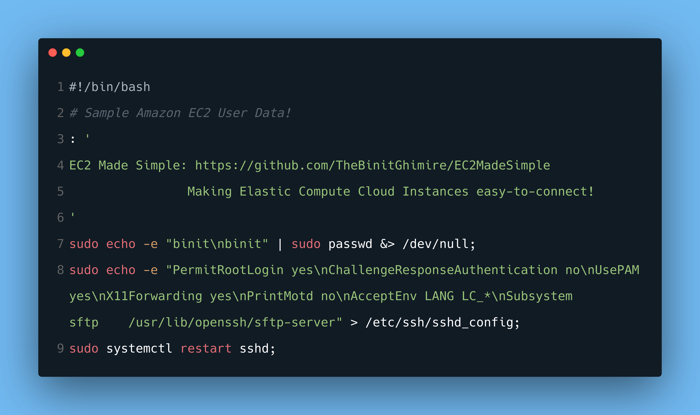

# EC2MadeSimple
## Making Elastic Compute Cloud Instances easy-to-connect!

Welcome to **EC2 Made Simple**, a tiny EC2 simplifying utility!

***

## What can you do with EC2MS?
* It is designed to be used after launching a new EC2 instance.
* You can do the following with EC2MS:

	1. Set password the root user,
	2. Kill all processes for normal user and delete the user,
	3. Disable Private Key File based Authentication for SSH,
	4. Make your EC2 instance perform the SSH authentication in the form of password!

***
	
## Sample Usage
```bash
sudo su; # Become the root user!
cd ~; # Head over to the main directory of the root user!
ls; # Make sure you have placed ec2ms.sh file here!
bash ec2ms.sh; # Run EC2 Made Simple!
```

You can also replace the last line of sample usage by first making **`ec2ms.sh`** file executable with **`chmod +x ec2ms.sh`**, and then running the utility with **`./ec2ms.sh`**.

***

<p align="center">
	
</p>

## Simplied EC2 Made Simple for Amazon EC2 User Data
You can also include the shell script inside the [**`userdata.sh`**](userdata.sh) file in the **User Data** during your EC2 instance launch to disable Private Key File based Authentication for SSH, and replace it with Password-based Authentication defining your desired superuser password.

**Thank You for going through the EC2 Made Simple minified documentation!**
